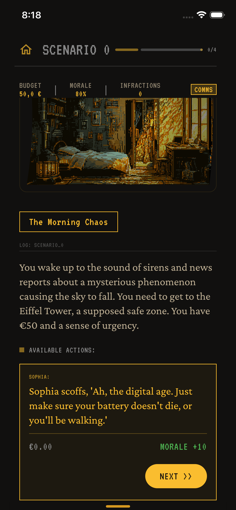
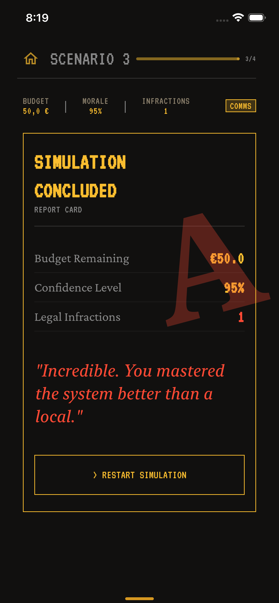

# Paris Transit Ace

<p align="center">
  
</p>

> **A Kotlin Multiplatform survival simulation game for navigating the Paris Metro, powered by AI.**


**Paris Transit Ace** is a cross-platform simulation game where players navigate the chaotic social and logistical challenges of the Paris public transport system. Make strategic decisions to manage your budget, morale, and legal standing while experiencing AI-generated scenarios unique to each playthrough.

---

## Motivation and Background

As an international student arriving in France, I quickly realized that navigating the Paris Metro is about more than just reading a map—it's about surviving the *culture*. From knowing how to handle a ticket inspector ("Contrôleur") to dealing with sudden strikes, there are unwritten rules that apps like Google Maps don't teach you.

I wanted to gamify this learning curve. Instead of a boring guide, I created a simulation game that teaches through experience. The goal was to solve the anxiety of the unknown by letting players make mistakes in a safe environment before facing the real thing.

By utilizing generative AI, the game creates unique scenarios every playthrough—no two games are the same. Players learn practical survival skills for French public transport while being entertained by the absurdity of it all.

---

## Table of Contents
- [Motivation and Background](#motivation-and-background)
- [Features](#features)
- [Supported Platforms](#supported-platforms)
- [Screenshots](#screenshots)
- [Technical Implementation](#technical-implementation)
  - [Architecture](#architecture)
  - [Generative AI](#generative-ai)
  - [Database](#database)
  - [UI & UX](#ui--ux)
- [How to Run](#how-to-run)
  - [Prerequisites](#prerequisites)
  - [API Key Configuration](#api-key-configuration)
  - [Running on Android](#running-on-android)
  - [Running on iOS](#running-on-ios)
- [Chat Commands](#chat-commands)
- [Game Mechanics](#game-mechanics)
- [Testing](#testing)
- [Project Structure](#project-structure)
- [Future Steps](#future-steps)
- [License](#license)

---

## Features

### AI-Driven Gameplay
* **Dynamic Scenario Generation:** AI generates unique storylines with branching choices based on your selected simulation type
* **Multiple AI Provider Support:** Supports Google Gemini, Mistral AI, and OpenAI APIs
* **Function Calling Integration:** AI can execute game commands directly through natural language
* **Bilingual Support:** Full support for English and French gameplay

### Game Mechanics
* **Player Stats Tracking:**
  - **Budget** - Manage your money wisely
  - **Morale** - Keep your spirits up
  - **Legal Infractions** - Breaking rules have consequences
* **Game Over Conditions:**
  - Budget drops below 0
  - Morale reaches 0
  - 3 or more legal infractions
* **Grading System:** Receive a final grade (A-F) based on your performance

### Persistence & Save System
* **Storyline Management:** Save, load, and delete your storylines

### Chat Commands
Natural language commands to control the game:
* View all saved storylines
* Load specific scenarios by name or ID
* Delete individual or all storylines
* Reset current level
* Clear chat history

---

## Supported Platforms

| Platform | Status |
|----------|--------|
| Android | ✅ Supported |
| iOS | ✅ Supported |

---

## Screenshots

<p align="center">

| Landing Screen | Gameplay | Game Over |
|:---:|:---:|:---:|
|  |  |  |

</p>

---

## Technical Implementation

### Architecture
The app follows **Clean Architecture** principles with Kotlin Multiplatform:

```
composeApp/
└── src/
    ├── commonMain/          # Shared code
    │   ├── domain/          # Business logic, models, use cases
    │   ├── data/            # Repositories, data sources
    │   └── ui/              # Compose UI, ViewModels
    ├── androidMain/         # Android-specific code
    └── iosMain/             # iOS-specific code
```

* **Domain Layer:** Pure Kotlin models (`StoryLine`, `Scenario`, `UserStats`), use cases, and repository interfaces
* **Data Layer:** Repository implementations, local (SQLDelight) and remote (LLM APIs) data sources
* **UI Layer:** Jetpack Compose Multiplatform, organized by feature (`game/`, `chat/`, `home/`, `landing/`)
* **Dependency Injection:** Koin for cross-platform DI

### Generative AI
Supports multiple AI providers:

| Provider | Model | Scenario Generation | Chat & Function Calling |
|----------|-------|:-------------------:|:-----------------------:|
| Google Gemini | gemini-2.5-flash | ✅ | ✅ |
| Mistral AI | mistral-small-latest | ✅ | ✅ |
| OpenAI | gpt-4o | ✅ | ❌ |

**Features:**
* **Scenario Generation:** All three providers can generate complete storylines with branching scenarios
* **Response Cleanup:** Automatically strips markdown code fences from AI responses

**Function Calling (Two Modes):**

The game supports executing commands through the chat interface using two different modes:

1. **Local Mode** - Commands are matched locally using regex patterns without calling the AI. This is the preferred mode for common commands because it provides instant responses, saves API costs, and works even when offline or when API keys are unavailable. Supported commands include:
   - `help`, `aide`, `?` - Show available commands
   - `stories`, `list` - Show all saved storylines
   - `load [name]` - Load a specific storyline
   - `delete [name]` - Delete a storyline
   - `delete all` - Delete all storylines
   - `reset` - Reset current level
   - `clear` - Clear chat history

2. **AI Mode** - If the message doesn't match any local command pattern, it falls back to the AI (Gemini or Mistral only) which can interpret natural language and execute function calls. This allows for flexible phrasing like "Can you show me what scenarios I have saved?" or "I want to play the metro strike story".

### Database
* **SQLDelight:** Cross-platform SQLite database
* **Tables:**
  - `StoryEntity` - Saved storylines
  - `ScenarioEntity` - Individual scenarios with options
  - `ChatMessages` - Conversation history
  - `SavedGameState` - Current game progress
  - `Settings` - User preferences

### UI & UX
* **Compose Multiplatform:** 100% shared UI code
* **State Management:** ViewModel + StateFlow pattern
* **Navigation:** Compose Navigation

---

## How to Run

### Prerequisites
* **JDK 17** or newer
* **Android Studio Ladybug** (2024.2.1) or newer
* **Xcode 15+** (for iOS builds on macOS)
* At least one AI API key (Gemini, Mistral, or OpenAI)

### API Key Configuration

1. Create `local.properties` in the project root:

```properties
# At least one key is required
GEMINI_API_KEY=your_gemini_api_key_here
MISTRALAI_API_KEY=your_mistral_api_key_here
OPENAI_API_KEY=your_openai_api_key_here
```

2. Run the application for the build system injects these keys via `BuildConfig`

> ⚠️ **Important:** Never commit `local.properties` to version control.

### Running on Android

**Using Android Studio:**
1. Open the project in Android Studio
2. Select the `composeApp` run configuration
3. Choose an Android emulator (API 29+) or physical device
4. Click Run

**Using Terminal:**
```shell
# Build
./gradlew :composeApp:assembleDebug

# Install on connected device
./gradlew :composeApp:installDebug
```

### Running on iOS

**Using Xcode:**
1. Open `iosApp/iosApp.xcodeproj` in Xcode
2. Select a simulator or physical device
3. Click Run

**Using Android Studio (with KMM plugin):**
1. Select the iOS run configuration
2. Choose a simulator
3. Click Run

---

## Chat Commands

The game supports natural language commands in English and French:

| Command | Examples |
|---------|----------|
| **Help** | `help`, `aide`, `h`, `?` |
| **Show Storylines** | `show me all storylines`, `stories`, `list` |
| **Load Storyline** | `load [name] scenario`, `load 1` |
| **Delete Storyline** | `delete [name]`, `remove storyline 1` |
| **Delete All** | `delete all`, `delete all storylines` |
| **Reset Level** | `reset`, `restart`, `reset this level` |
| **Clear Chat** | `clear`, `cls`, `clear chat` |

---

## Game Mechanics

### Stats
| Stat | Description | Game Over Condition |
|------|-------------|---------------------|
| Budget | Your available money | Below 0 |
| Morale | Your mental state | Reaches 0 |
| Legal Infractions | Rule violations | 3 or more |

### Grading
Your final grade is calculated based on:
* Percentage of budget remaining (50% weight)
* Percentage of morale remaining (50% weight)
* Legal infractions cap your maximum grade:
  - 0 infractions: Can achieve A
  - 1 infraction: Maximum grade is C
  - 2 infractions: Maximum grade is D
  - 3+ infractions: Automatic F

| Grade | Score Range |
|-------|-------------|
| A | 90-100 (0 infractions only) |
| B | 75-89 (0 infractions only) |
| C | 60-74 (or max with 1 infraction) |
| D | 40-59 (or max with 2 infractions) |
| E | 20-39 |
| F | 0-19 or 3+ infractions |

---

## Testing

Run all tests:
```shell
./gradlew check
```

Run specific tests:
```shell
# Common unit tests
./gradlew :composeApp:testDebugUnitTest
```

---

## Project Structure

```
ParisTransitAce/
├── composeApp/
│   └── src/
│       ├── commonMain/kotlin/com/alajemba/paristransitace/
│       │   ├── data/
│       │   │   ├── local/         # SQLDelight data source
│       │   │   ├── remote/        # LLM API clients
│       │   │   ├── repository/    # Repository implementations
│       │   │   └── mapper/        # Data mappers
│       │   ├── domain/
│       │   │   ├── model/         # Domain models
│       │   │   ├── repository/    # Repository interfaces
│       │   │   └── usecase/       # Business logic
│       │   ├── ui/
│       │   │   ├── chat/          # Chat UI components
│       │   │   ├── game/          # Game screen
│       │   │   ├── home/          # Home/setup screen
│       │   │   ├── landing/       # Landing screen
│       │   │   ├── components/    # Shared UI components
│       │   │   ├── viewmodels/    # ViewModels
│       │   │   ├── navigation/    # Navigation setup
│       │   │   └── theme/         # Colors, typography
│       │   └── di/                # Koin modules
│       ├── androidMain/           # Android implementations
│       ├── iosMain/               # iOS implementations
│       └── commonTest/            # Shared tests
├── iosApp/                        # iOS app entry point
├── gradle/                        # Gradle wrapper & version catalog
└── local.properties               # API keys (not committed)
```

---

## Future Steps

* **Voice Mode:** Audio-to-text for verbal interactions
* **Leaderboard:** Global rankings
* **More Themes:** Additional scenario themes and storylines
* **Sound Effects:** Ambient metro sounds and feedback

---

## License

This project is licensed under the MIT License - see the [LICENSE](LICENSE) file for details.

